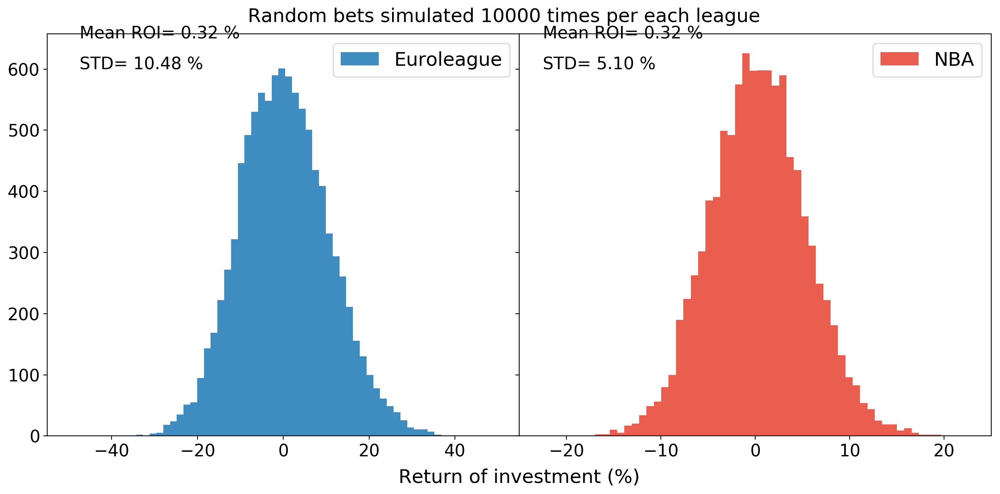
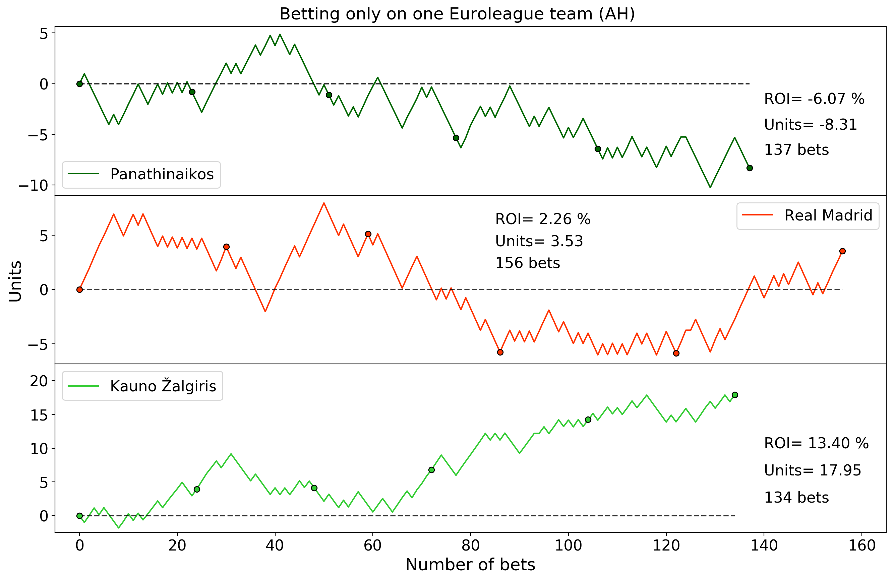
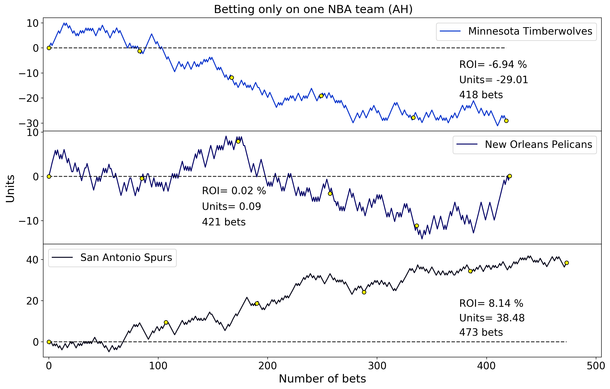

## Installation

All code was written in Python 3.6. Necessary dependencies are provided in `requirements.txt`.

## Project motivation

This project was inspired by Udacity Data Scientist Nanodegree mini project *"Write A Data Science Blog
 Post"*. I wanted to practice
  [CRISP-DM process](https://en.wikipedia.org/wiki/Cross-industry_standard_process_for_data_mining) 
  on  sports performance and betting data. My initial questions were:
  
* Which are the most unprofitable bets?
* Are there any blind betting profitable strategies?
* What are the main differences between North America and Europe leagues?
* Do sports markets correct themselves overtime?
* Who are the most successful winners?
  
In this repository, you will find notebooks for both web-scrapping and data analysis.
  
So far, I investigated only top basketball leagues. Some of the answers to the questions could be found in `basketball_all_data_processing.ipynb` notebook. A more detailed analysis of 
NBA odds is provided in `nba_blog_post.ipynb` notebook. Results were used to write [a blog post](https://medium.com/@t.uzdavinys/statistical-analysis-of-nba-odds-how-to-not-lose-money-betting-on-basketball-bc41fe239561).

## Interesting observations

* Closing odds reflect true probabilities: for both top basketball leagues:

* Randomly betting on closing odds is not profitable in long run:

* Basketball team average total points scored increases over seasons:

* Blindly supporting Euroleague teams on asian handicap bets would have following results:

Some fans win through all 5 seasons, while others lose.

* Blindly supporting NBA teams on asian handicap bets would have following results:

Some fans win through all 5 seasons, while others lose.

## File description

* `basketball_data_scraper.ipynb` notebook with NBA and Euroleague data scraping code.
* `data_processing.ipynb` notebook with all basketball data processing and analysis code.
* `nba_blog_post.ipynb` notebook with data processing for blog post at [Medium](https://medium.com/@t.uzdavinys/statistical-analysis-of-nba-odds-how-to-not-lose-money-betting-on-basketball-bc41fe239561).
* `geckodriver.exe` executable file for Mozilla Firefox.
* Folder `data` contains .csv files with scraped data:
  * `basketball_games.csv` scraped NBA and Euroleague 2013-2018 seasons data.
  * `NBA_20XX_20YY.csv` and `EURO_20XX_20YY.csv` asian handicap and totals (under/over X) for NBA and Euroleague 2013-2018 seasons games.
* Folder `images` contains various .png files.
